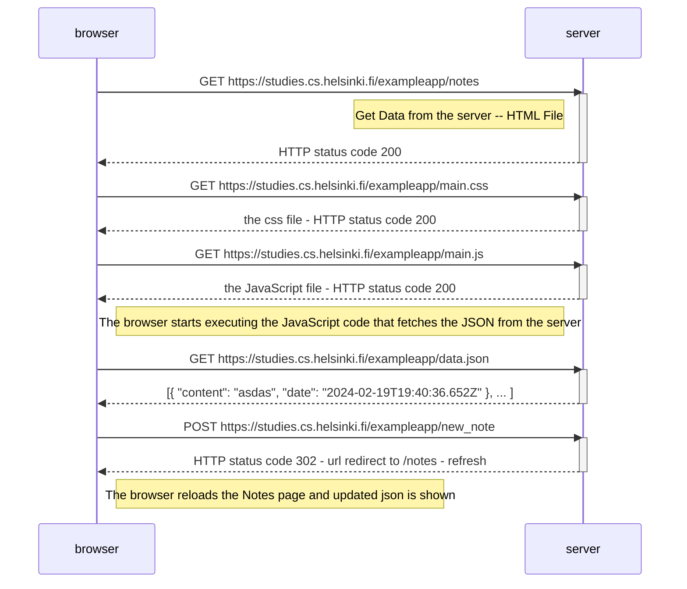

```mermaid
sequenceDiagram
    participant browser
    participant server
    
    browser->>server: GET https://studies.cs.helsinki.fi/exampleapp/notes
    activate server 
    Note left of server: Get Data from the server -- HTML File

    server-->>browser: HTTP status code 200
    deactivate server

    browser->>server: GET https://studies.cs.helsinki.fi/exampleapp/main.css
    activate server
    server-->>browser: the css file - HTTP status code 200
    deactivate server

    browser->>server: GET https://studies.cs.helsinki.fi/exampleapp/main.js
    activate server
    server-->>browser: the JavaScript file - HTTP status code 200
    deactivate server

     Note right of browser: The browser starts executing the JavaScript code that fetches the JSON from the server

    browser->>server: GET https://studies.cs.helsinki.fi/exampleapp/data.json
    activate server
    server-->>browser: [{ "content": "asdas", "date": "2024-02-19T19:40:36.652Z" }, ... ]
    deactivate server

    browser->>server: POST https://studies.cs.helsinki.fi/exampleapp/new_note
    activate server
    server-->>browser: HTTP status code 302 - url redirect to /notes - refresh
    deactivate server
    
    Note right of browser: The browser reloads the Notes page and updated json is shown


```